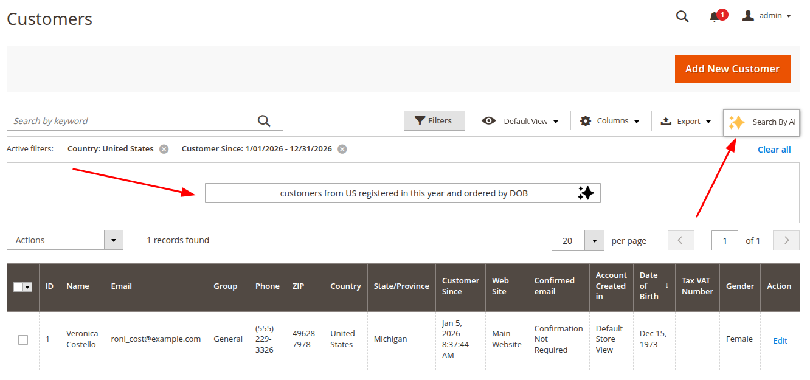
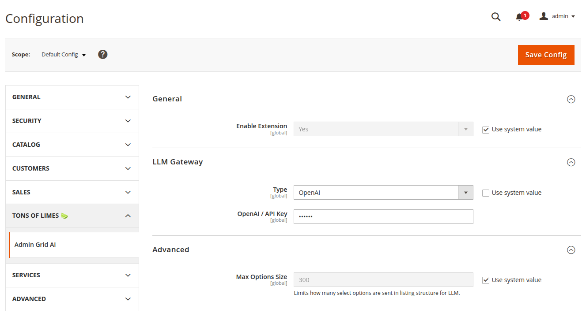

# Admin Grid AI for Magento 2

A powerful Magento 2 module that enhances admin grids with AI capabilities, allowing administrators to interact with grid data using natural language. Search, filter, sort, and manage columns in any UI Component grid using AI-powered queries.



## Features

- 🤖 **Natural Language Queries** - Use plain English to search and filter grid data
- 🔍 **Smart Filtering** - AI automatically applies appropriate filters based on your query
- 📊 **Column Management** - Show/hide columns through natural language commands
- 🔄 **Sorting Control** - Sort data using conversational instructions
- 🔌 **Multiple LLM Gateways** - Support for OpenAI, OpenRouter, and custom OpenAI-compatible APIs
- ⚡ **UI Component Compatible** - Works with all Magento 2 UI Component grids

## Requirements

- PHP 8.2, 8.3, or 8.4
- Magento 2.4.x or higher
- OpenAI API key or compatible LLM gateway

## Installation

Install the module via Composer using the meta package:

```bash
composer require tonsoflimes/magento-admin-grid-ai-meta

php bin/magento module:enable TonsOfLimes_AdminGridAI
php bin/magento setup:upgrade
php bin/magento setup:di:compile
php bin/magento setup:static-content:deploy -f
```

## Configuration

Navigate to **Stores** > **Configuration** > **tons of limes 🍋‍🟩** > **Admin Grid AI**



### General Settings

- **Enable Extension**: Set to "Yes" to activate AI features across admin grids

### LLM Gateway Configuration

Choose your preferred LLM gateway type and configure the credentials:

#### Option A: OpenAI

1. Set **Type** to "OpenAI"
2. Enter your **OpenAI API Key**

#### Option B: OpenRouter

1. Set **Type** to "OpenRouter"
2. Enter **Base URI** (default: `https://openrouter.ai/api/v1`)
3. Enter your **OpenRouter API Key**

#### Option C: Custom Gateway
Custom OpenAI-compatible API gateway (e.g. self-hosted LLM)

1. Set **Type** to "Custom Gateway"
2. Enter your **Custom Base URI**
3. Enter your **Custom API Key**

### Advanced Settings

- **Max Options Size**: Limits the number of select options sent to the LLM (default: 300)
  - Helps optimize API requests for grids with large option sets

## Usage

Once configured, the "Search by AI" feature will be available on all UI Component grids in the Magento admin panel.

### How to Use

1. Navigate to any admin grid (e.g., Products, Orders, Customers)
2. Look for the **Search by AI** interface in the grid toolbar
3. Enter your natural language query, such as:
   - "Show only enabled products"
   - "Display orders from last month"
   - "Filter customers from New York"
   - "Sort by price descending"
   - "Hide SKU and weight columns"
4. The AI will interpret your request and apply the appropriate filters, sorting, or column visibility changes

### Example Queries

**Filtering:**
- "Show products with stock quantity less than 10"
- "Display orders with status pending"
- "Filter by customers who registered this year"

**Sorting:**
- "Sort by created date, newest first"
- "Order by price from high to low"

**Column Management:**
- "Show only name, SKU, and price columns"
- "Hide all attribute columns"

**Combined Actions:**
- "Show enabled products sorted by price, hide description column"

## Limitations

- Only works with **UI Component grids** (not legacy grids)
- Query interpretation depends on LLM model capabilities

## Support

For issues, feature requests, or contributions, please visit:
- GitHub: [tons-of-limes](https://github.com/tons-of-limes)

## Author

**tons of limes** 🍋‍🟩

---

Copyright © [tons of limes](https://github.com/tons-of-limes). All rights reserved.
